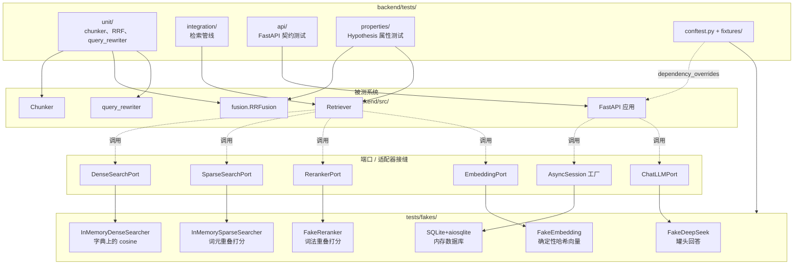
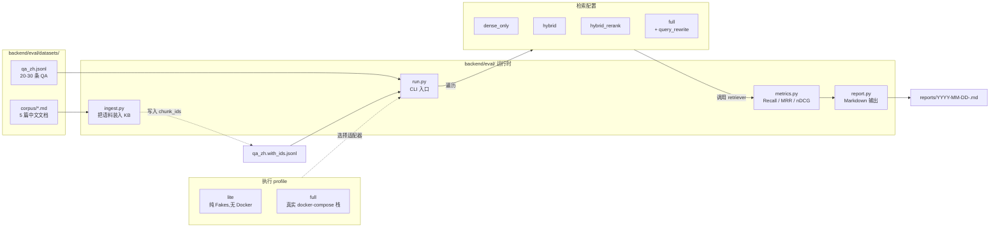
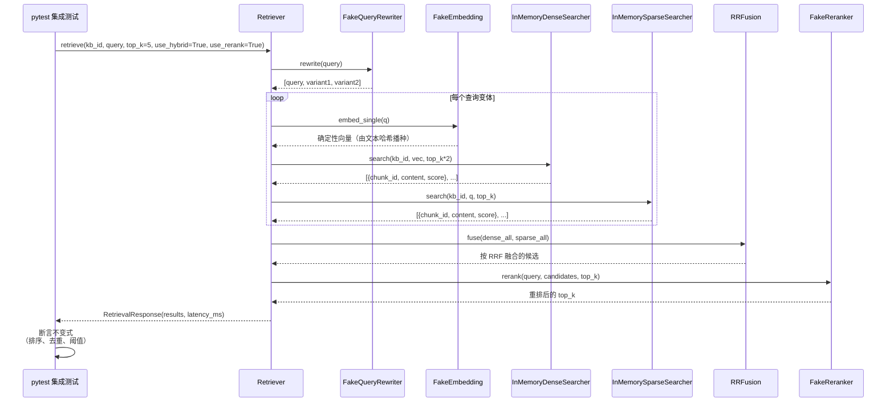

# 设计文档：测试与评测框架

## 概述（Overview）

RAGForce 目前没有任何自动化测试，也没有检索质量的度量机制。本特性落地两个互补的支柱：

1. **Scope A — 核心测试套件**（`backend/tests/`）：一套基于 pytest 的测试工程，覆盖
   - 纯逻辑的单元测试（chunker、RRF 融合、query rewriter、context assembly、eval 指标）
   - 使用 Fakes/Mocks 替代 Milvus、PostgreSQL BM25、embedding/reranker HTTP 服务、DeepSeek 的检索管线集成测试
   - 借助 `httpx.AsyncClient` + ASGI 传输、以 `app.dependency_overrides` 把数据库依赖切换为内存 SQLite 的 FastAPI API 契约测试
   - 基于 Hypothesis 的属性测试（Property-Based Testing）

2. **Scope B — 检索质量评测框架**（`backend/eval/`）：一套可复现的离线评测工具，包含
   - 一份内置的中文 QA 数据集
   - 一个复用生产 ingestion 服务的语料入库脚本
   - 按检索配置矩阵（dense-only、hybrid、hybrid+rerank、full）迭代运行并计算 Recall@k / MRR@k / nDCG@k / 延迟 p50/p95 的 runner
   - 一份适合 README 展示的 Markdown 报告

设计在每一处外部边界都强调 **Port / Adapter 接缝**（Milvus、PostgreSQL BM25、embedding HTTP、reranker HTTP、DeepSeek、Celery），从而使测试和 eval-lite 模式无需 Docker 即可运行；同时 full 集成 profile 与 eval runner 仍可通过配置切回真实 docker-compose 栈。

两个支柱的目标是：在一台干净的机器上执行 `pip install -e ".[dev]"` 之后，单元 + 集成层在 30 秒内跑完，可直接纳入 CI。

---

## 高层设计（High-Level Design）

### HLD-1. 组件图 — 测试工程



**要点**：
- 生产代码当前是模块级单例（`dense_searcher`、`sparse_searcher`、`embedding_service`、`reranker_service`、`query_rewriter`、`deepseek_chat`、`retriever`）。测试工程通过 `monkeypatch.setattr` 替换这些模块属性，让 SUT 看到 duck-typed 接口一致的 Fakes，**无需对生产代码做结构性重构**。
- FastAPI 的 `app.dependency_overrides` 把 `core.database.get_db` 换成由 SQLite+aiosqlite 驱动的会话工厂。
- `httpx.AsyncClient(transport=ASGITransport(app=app))` 在进程内驱动 API，避开网络与 Uvicorn。

### HLD-2. 组件图 — 评测框架



**要点**：
- ingest 复用**真实**的 `DocumentChunker`、`Chunk` schema 和一个可配置的 indexer：lite 模式下 indexer 写入内存存储，由 Fake dense/sparse searchers 读取；full 模式下 `MilvusIndexer` 才真正生效。
- 数据集每次 run 时入库一次；chunk 生成稳定的 `chunk_id`，再把它们回填到 QA 文件以得到 ground-truth `relevant_chunk_ids`。
- 每种检索配置是一个 flag 元组（`use_hybrid`、`use_rerank`、`use_query_rewrite`）；runner 以不同元组调用 `retriever.retrieve(...)`，并收集 `(query, retrieved_chunk_ids, latency_ms)`。

### HLD-3. 检索管线时序（集成测试视角）



### HLD-4. docker-compose 服务依赖矩阵

| 场景                            | postgres | milvus | redis | rabbitmq | minio | embedding | reranker | deepseek |
|---------------------------------|:--------:|:------:|:-----:|:--------:|:-----:|:---------:|:--------:|:--------:|
| 单元测试                         | —        | —      | —     | —        | —     | —         | —        | —        |
| 集成测试（进程内）                | sqlite†  | fake   | —     | —        | —     | fake      | fake     | fake     |
| API 契约测试                     | sqlite†  | fake   | —     | —        | —     | fake      | fake     | fake     |
| eval — lite profile              | sqlite†  | fake   | —     | —        | —     | fake      | fake     | —        |
| eval — full profile              | ✓        | ✓      | —     | —        | —     | ✓         | ✓        | —        |
| eval — full+chat（可选）         | ✓        | ✓      | —     | —        | —     | ✓         | ✓        | ✓        |

† 通过 `app.dependency_overrides` 用 `sqlite+aiosqlite` 替换真实 PostgreSQL。full eval 也可以使用 SQLite 存元数据；chunk 存储由 Milvus / 内存 store 负责。

---

## 低层设计（Low-Level Design）

### LLD-1. 模块布局

```
backend/
├── pyproject.toml                  # 扩展 dev 依赖、pytest 与 coverage 配置
├── tests/
│   ├── __init__.py
│   ├── conftest.py                 # event_loop、async_client、db_session、Fakes 接线
│   ├── fixtures/
│   │   ├── __init__.py
│   │   ├── sample.pdf              # conftest 运行时用 reportlab 生成的 2 页 PDF
│   │   ├── sample.docx             # python-docx 生成的微型 DOCX
│   │   └── seeded_kb.py            # KB / Document / Chunk 行的工厂
│   ├── fakes/
│   │   ├── __init__.py
│   │   ├── embedding.py            # FakeEmbeddingService
│   │   ├── reranker.py             # FakeRerankerService
│   │   ├── dense_searcher.py       # InMemoryDenseSearcher
│   │   ├── sparse_searcher.py      # InMemorySparseSearcher
│   │   ├── query_rewriter.py       # FakeQueryRewriter
│   │   └── deepseek.py             # FakeDeepSeekChat
│   ├── unit/
│   │   ├── test_chunker.py
│   │   ├── test_fusion.py
│   │   ├── test_query_rewriter.py
│   │   └── test_context_assembly.py
│   ├── integration/
│   │   ├── test_retriever_pipeline.py
│   │   └── test_ingestion_pipeline.py
│   ├── api/
│   │   ├── test_knowledge_bases_api.py
│   │   ├── test_documents_api.py
│   │   ├── test_retrieval_api.py
│   │   ├── test_chat_api.py
│   │   └── test_audit_logs_api.py
│   └── properties/
│       ├── test_rrf_properties.py
│       ├── test_retriever_properties.py
│       └── test_chunker_properties.py
└── eval/
    ├── __init__.py
    ├── README.md                   # 复现步骤与样例输出
    ├── __main__.py                 # `python -m eval.run ...` 入口
    ├── run.py                      # CLI 入口（argparse）
    ├── ingest.py                   # 语料 → KB 入库
    ├── config.py                   # RunConfig / profile 解析
    ├── metrics.py                  # Recall@k、MRR@k、nDCG@k、延迟百分位
    ├── report.py                   # Markdown 对比矩阵
    ├── profiles/
    │   ├── lite.py                 # Fake 适配器
    │   └── full.py                 # 真实 docker-compose 适配器
    ├── datasets/
    │   ├── corpus/
    │   │   ├── doc_01_rag.md
    │   │   ├── doc_02_milvus.md
    │   │   ├── doc_03_bge.md
    │   │   ├── doc_04_rrf.md
    │   │   └── doc_05_deepseek.md
    │   └── qa_zh.jsonl             # 20-30 条 QA，relevant_doc_ids 用文件名标注
    └── reports/                    # gitignored 的输出目录
        └── .gitkeep
```

### LLD-2. Pytest 配置

扩展 `backend/pyproject.toml`：

```toml
[project.optional-dependencies]
dev = [
    "pytest>=8.0.0",
    "pytest-asyncio>=0.23.0",
    "pytest-cov>=4.1.0",
    "hypothesis>=6.98.0",
    "httpx>=0.26.0",
    "aiosqlite>=0.19.0",
    "reportlab>=4.0.0",         # 用于生成 fixtures/sample.pdf
    "respx>=0.20.0",            # 可选：用于 httpx mock 传输的 service 层测试
    "ruff>=0.1.0",
    "mypy>=1.8.0",
]

[tool.pytest.ini_options]
minversion = "8.0"
asyncio_mode = "auto"
testpaths = ["tests"]
pythonpath = ["src"]
addopts = [
    "-ra",
    "--strict-markers",
    "--strict-config",
    "--cov=src",
    "--cov-report=term-missing",
    "--cov-report=xml",
    "--cov-fail-under=60",
]
markers = [
    "unit: 纯逻辑测试，无 I/O",
    "integration: 使用 Fakes 的管线测试，无网络/Docker",
    "api: FastAPI 契约测试",
    "property: Hypothesis 属性测试",
    "slow: 默认跳过，通过 -m slow 显式开启",
    "docker: 需要 docker-compose 服务（默认跳过）",
]

[tool.coverage.run]
branch = true
source = ["src/services", "src/api"]
omit = ["src/worker/*", "src/main.py"]

[tool.coverage.report]
exclude_lines = [
    "pragma: no cover",
    "raise NotImplementedError",
    "if TYPE_CHECKING:",
]
```

默认 CI 调用方式：`pytest -m "not docker and not slow"`。

### LLD-3. 端口接口（duck-typed，以 Protocol 形式记录）

我们 **不会** 改动生产的单例模式，这里仅记录 Fakes 必须遵守的形状。如果未来想要类型检查提示，可以将它们作为 `typing.Protocol` 放进 `src/services/retrieval/ports.py` — 可选。

```python
# backend/tests/fakes/_protocols.py  仅作文档说明；运行时仍然是 duck typing

from typing import Protocol


class EmbeddingPort(Protocol):
    # 端口：向量化服务
    async def embed_batch(self, texts: list[str]) -> list[list[float]]: ...
    async def embed_single(self, text: str) -> list[float]: ...


class DenseSearchPort(Protocol):
    # 端口：稠密检索（Milvus）
    async def search(
        self, kb_id: str, query_embedding: list[float], top_k: int = 5
    ) -> list[dict]: ...  # 每个 dict：chunk_id、document_id、content、content_type、score


class SparseSearchPort(Protocol):
    # 端口：稀疏检索（PostgreSQL BM25）
    async def search(self, kb_id: str, query: str, top_k: int = 5) -> list[dict]: ...


class RerankerPort(Protocol):
    # 端口：交叉编码器重排
    async def rerank(
        self, query: str, candidates: list[dict], top_k: int = 5
    ) -> list[dict]: ...


class QueryRewriterPort(Protocol):
    # 端口：查询改写
    async def rewrite(self, query: str) -> list[str]: ...


class ChatLLMPort(Protocol):
    # 端口：对话大模型（DeepSeek）
    async def generate(
        self, query: str, context_chunks: list[dict], history: list[dict] | None = None
    ) -> "ChatResponse": ...
```

### LLD-4. Fake 实现

```python
# backend/tests/fakes/embedding.py
import hashlib
import math


class FakeEmbeddingService:
    """从文本的 SHA256 派生、经 L2 归一化的确定性 1024 维向量。

    两段文本若共享较多子串，其向量也会相关（通过 char-ngram 词袋），
    因此 cosine 相似度大致跟随词汇重叠 —— 对检索类测试已经够用。
    """

    DIM = 1024

    def __init__(self, dim: int = 1024) -> None:
        self.dim = dim
        self.calls: list[str] = []  # 调用日志，可在测试中断言

    async def embed_batch(self, texts: list[str]) -> list[list[float]]:
        # 批量向量化：记录输入，对每条文本调用 _vec
        self.calls.extend(texts)
        return [self._vec(t) for t in texts]

    async def embed_single(self, text: str) -> list[float]:
        # 单条向量化：直接复用 embed_batch
        return (await self.embed_batch([text]))[0]

    def _vec(self, text: str) -> list[float]:
        # 用 2-char 和 3-char 的子串（shingle）哈希到索引构造特征向量
        vec = [0.0] * self.dim
        shingles = set()
        for n in (2, 3):
            for i in range(max(0, len(text) - n + 1)):
                shingles.add(text[i:i + n])
        for s in shingles:
            # 将每个 shingle 的 SHA256 前 8 字节解释为整数，取模后累加
            h = int.from_bytes(hashlib.sha256(s.encode("utf-8")).digest()[:8], "big")
            vec[h % self.dim] += 1.0
        # L2 归一化，避免 0 向量
        norm = math.sqrt(sum(x * x for x in vec)) or 1.0
        return [x / norm for x in vec]
```

```python
# backend/tests/fakes/dense_searcher.py
import math


class InMemoryDenseSearcher:
    """基于内存 {kb_id: [chunk_record]} 存储的 cosine 相似度检索。"""

    def __init__(self) -> None:
        self.store: dict[str, list[dict]] = {}

    def seed(self, kb_id: str, records: list[dict]) -> None:
        # 预置记录：{chunk_id, document_id, content, content_type, embedding}
        self.store.setdefault(kb_id, []).extend(records)

    async def search(
        self, kb_id: str, query_embedding: list[float], top_k: int = 5
    ) -> list[dict]:
        # 遍历该 kb 下所有记录，计算 cosine 相似度并取 top_k
        hits = []
        for r in self.store.get(kb_id, []):
            score = _cosine(query_embedding, r["embedding"])
            hits.append({
                "chunk_id": r["chunk_id"],
                "document_id": r["document_id"],
                "content": r["content"],
                "content_type": r.get("content_type", "text"),
                "score": score,
            })
        hits.sort(key=lambda h: h["score"], reverse=True)
        return hits[:top_k]


def _cosine(a: list[float], b: list[float]) -> float:
    # 计算余弦相似度，做零向量保护
    dot = sum(x * y for x, y in zip(a, b))
    na = math.sqrt(sum(x * x for x in a)) or 1.0
    nb = math.sqrt(sum(x * x for x in b)) or 1.0
    return dot / (na * nb)
```

```python
# backend/tests/fakes/sparse_searcher.py
from collections import Counter


class InMemorySparseSearcher:
    """简单的词元重叠打分，模拟 BM25 的行为用于测试。"""

    def __init__(self) -> None:
        self.store: dict[str, list[dict]] = {}

    def seed(self, kb_id: str, records: list[dict]) -> None:
        # 预置记录到内存字典
        self.store.setdefault(kb_id, []).extend(records)

    async def search(self, kb_id: str, query: str, top_k: int = 5) -> list[dict]:
        # 对 query 和每条记录的 content 计算词元重叠，保留命中项
        q_tokens = _tokenize(query)
        hits = []
        for r in self.store.get(kb_id, []):
            d_tokens = _tokenize(r["content"])
            score = _overlap(q_tokens, d_tokens)
            if score > 0:
                hits.append({**r, "score": float(score)})
        hits.sort(key=lambda h: h["score"], reverse=True)
        return hits[:top_k]


def _tokenize(s: str) -> Counter:
    # 粗粒度分词：CJK 单字 + ASCII 词，小写化
    import re
    tokens = re.findall(r"[A-Za-z0-9]+|[\u4e00-\u9fff]", s.lower())
    return Counter(tokens)


def _overlap(a: Counter, b: Counter) -> int:
    # 两个 Counter 的交集元素总数
    return sum((a & b).values())
```

```python
# backend/tests/fakes/reranker.py
class FakeRerankerService:
    """保持候选集不变，仅按查询与候选内容的词元重叠重打分。"""

    async def rerank(
        self, query: str, candidates: list[dict], top_k: int = 5
    ) -> list[dict]:
        # 复用 sparse_searcher 里的分词与重叠函数
        from tests.fakes.sparse_searcher import _tokenize, _overlap
        q = _tokenize(query)
        rescored = []
        for c in candidates:
            score = float(_overlap(q, _tokenize(c["content"])))
            rescored.append({**c, "score": score})
        rescored.sort(key=lambda x: x["score"], reverse=True)
        return rescored[:top_k]
```

```python
# backend/tests/fakes/query_rewriter.py
class FakeQueryRewriter:
    """默认恒等变换；可在构造时注入额外变体列表。"""

    def __init__(self, variants: list[str] | None = None) -> None:
        # variants：除了原始 query 之外额外追加的改写变体
        self.variants = variants or []

    async def rewrite(self, query: str) -> list[str]:
        # 返回列表的首元素始终是原始 query，保证回退行为可测
        return [query, *self.variants]
```

```python
# backend/tests/fakes/deepseek.py
import time
from schemas.chat import ChatResponse, Citation


class FakeDeepSeekChat:
    """返回基于上下文拼装的罐头回答，永不发起网络请求。"""

    def __init__(self, answer: str = "(fake-answer)") -> None:
        self.answer = answer

    async def generate(self, query, context_chunks, history=None) -> ChatResponse:
        start = time.time()
        # 将每个 context chunk 映射为一条 Citation，content 截断到 200 字符
        citations = [
            Citation(
                chunk_id=c.get("chunk_id", ""),
                document_name=c.get("document_name", ""),
                content=c["content"][:200],
                score=c.get("score", 0.0),
            )
            for c in context_chunks
        ]
        return ChatResponse(
            answer=f"{self.answer} | q={query} | n_ctx={len(context_chunks)}",
            citations=citations,
            latency_ms=round((time.time() - start) * 1000, 2),
        )

    async def generate_stream(self, query, context_chunks, history=None):
        # 模拟一段最小的 SSE delta，避免真正去请求网络
        yield '{"choices":[{"delta":{"content":"hello"}}]}'
```

### LLD-5. 核心 Fixtures（`tests/conftest.py`）

```python
# backend/tests/conftest.py
import asyncio
import os
from pathlib import Path

import pytest
import pytest_asyncio
from httpx import AsyncClient, ASGITransport
from sqlalchemy.ext.asyncio import AsyncSession, async_sessionmaker, create_async_engine

# 保证 src 在 import 路径上（pyproject 已通过 pythonpath 设置，此处只做环境变量兜底）
os.environ.setdefault("DEEPSEEK_API_KEY", "test")
os.environ.setdefault("UPLOAD_DIR", "./.test_uploads")


# ---- async 事件循环（session 级复用以加速） ----
@pytest.fixture(scope="session")
def event_loop():
    # Windows 上需使用 Selector 策略，避免 ProactorEventLoop 与 aiosqlite/httpx 的兼容问题
    import sys
    if sys.platform == "win32":
        asyncio.set_event_loop_policy(asyncio.WindowsSelectorEventLoopPolicy())
    loop = asyncio.new_event_loop()
    yield loop
    loop.close()


# ---- 内存 SQLite 会话 ----
@pytest_asyncio.fixture
async def async_engine():
    # 用 aiosqlite 驱动创建内存 async engine
    engine = create_async_engine("sqlite+aiosqlite:///:memory:", future=True)
    from models.base import Base
    # 确保每个模型模块被导入一次，注册到 Base.metadata 上
    import models  # noqa: F401
    async with engine.begin() as conn:
        await conn.run_sync(Base.metadata.create_all)
    yield engine
    await engine.dispose()


@pytest_asyncio.fixture
async def db_session(async_engine) -> AsyncSession:
    # 每个测试用例拿到独立的 AsyncSession
    factory = async_sessionmaker(async_engine, expire_on_commit=False)
    async with factory() as session:
        yield session


# ---- 带数据库依赖覆写的 FastAPI 应用 ----
@pytest_asyncio.fixture
async def app(async_engine):
    from main import app as fastapi_app
    from core.database import get_db

    factory = async_sessionmaker(async_engine, expire_on_commit=False)

    async def _override_get_db():
        # 覆写 get_db：每次请求开一个测试会话，完成后提交或回滚
        async with factory() as s:
            try:
                yield s
                await s.commit()
            except Exception:
                await s.rollback()
                raise

    fastapi_app.dependency_overrides[get_db] = _override_get_db
    yield fastapi_app
    # Fixture 拆解时清空 overrides，避免跨用例污染
    fastapi_app.dependency_overrides.clear()


@pytest_asyncio.fixture
async def async_client(app):
    # 用 ASGITransport 在进程内驱动 FastAPI，无需真正启动 uvicorn
    transport = ASGITransport(app=app)
    async with AsyncClient(transport=transport, base_url="http://test") as client:
        yield client


# ---- 将 Fakes 注入生产单例 ----
@pytest.fixture
def fake_embedding(monkeypatch):
    from tests.fakes.embedding import FakeEmbeddingService
    fake = FakeEmbeddingService()
    # 注入 ingest 与 retrieve 两处共用的 embedding_service 单例
    monkeypatch.setattr("services.ingestion.embedder.embedding_service", fake)
    monkeypatch.setattr("services.retrieval.retriever.embedding_service", fake)
    return fake


@pytest.fixture
def fake_dense(monkeypatch):
    from tests.fakes.dense_searcher import InMemoryDenseSearcher
    fake = InMemoryDenseSearcher()
    # 仅替换 retriever 模块引用的 dense_searcher
    monkeypatch.setattr("services.retrieval.retriever.dense_searcher", fake)
    return fake


@pytest.fixture
def fake_sparse(monkeypatch):
    from tests.fakes.sparse_searcher import InMemorySparseSearcher
    fake = InMemorySparseSearcher()
    # 替换 retriever 模块引用的 sparse_searcher
    monkeypatch.setattr("services.retrieval.retriever.sparse_searcher", fake)
    return fake


@pytest.fixture
def fake_reranker(monkeypatch):
    from tests.fakes.reranker import FakeRerankerService
    fake = FakeRerankerService()
    # 替换 retriever 模块引用的 reranker_service
    monkeypatch.setattr("services.retrieval.retriever.reranker_service", fake)
    return fake


@pytest.fixture
def fake_query_rewriter(monkeypatch):
    from tests.fakes.query_rewriter import FakeQueryRewriter
    fake = FakeQueryRewriter()
    # 替换 retriever 模块引用的 query_rewriter
    monkeypatch.setattr("services.retrieval.retriever.query_rewriter", fake)
    return fake


@pytest.fixture
def fake_deepseek(monkeypatch):
    from tests.fakes.deepseek import FakeDeepSeekChat
    fake = FakeDeepSeekChat()
    # 替换 chat 路由引用的 deepseek_chat
    monkeypatch.setattr("api.v1.chat.deepseek_chat", fake)
    return fake


@pytest.fixture
def wired_pipeline(fake_embedding, fake_dense, fake_sparse,
                   fake_reranker, fake_query_rewriter):
    """组合 Fixture：一口气注入检索管线所需的 5 个 Fakes。"""
    return {
        "embedding": fake_embedding,
        "dense": fake_dense,
        "sparse": fake_sparse,
        "reranker": fake_reranker,
        "query_rewriter": fake_query_rewriter,
    }


# ---- 样例语料工厂 ----
@pytest.fixture
def seeded_kb(wired_pipeline):
    """向 InMemoryDense/Sparse 存储预置 3 篇文档共 5 条 chunk。"""
    import asyncio
    kb_id = "kb-test-001"
    records = _sample_records(kb_id)
    # 对每条记录的 content 确定性地计算 embedding
    emb = wired_pipeline["embedding"]
    for r in records:
        r["embedding"] = asyncio.get_event_loop().run_until_complete(
            emb.embed_single(r["content"])
        )
    wired_pipeline["dense"].seed(kb_id, records)
    wired_pipeline["sparse"].seed(kb_id, records)
    return {"kb_id": kb_id, "records": records}


def _sample_records(kb_id: str) -> list[dict]:
    # 返回 5 条具备语义差异的中文 chunk，方便测试验证检索/融合/重排效果
    return [
        {"chunk_id": "c1", "document_id": "d1",
         "content": "Milvus 是一个开源的向量数据库，支持高性能相似度搜索。", "content_type": "text"},
        {"chunk_id": "c2", "document_id": "d1",
         "content": "Milvus 使用 IVF_FLAT 等索引结构加速向量检索。", "content_type": "text"},
        {"chunk_id": "c3", "document_id": "d2",
         "content": "BGE-M3 是一个支持中英双语的句向量模型，输出 1024 维向量。", "content_type": "text"},
        {"chunk_id": "c4", "document_id": "d2",
         "content": "Cross-Encoder 重排序模型对候选文档精排。", "content_type": "text"},
        {"chunk_id": "c5", "document_id": "d3",
         "content": "RRF 倒数排名融合将多路检索结果合并。", "content_type": "text"},
    ]
```

### LLD-6. 单元测试草图

```python
# tests/unit/test_fusion.py
import pytest
from services.retrieval.fusion import RRFusion


@pytest.mark.unit
def test_rrf_empty_both():
    # 两路输入均为空：结果必须为空列表
    assert RRFusion().fuse([], []) == []


@pytest.mark.unit
def test_rrf_single_dense_list_preserves_order():
    # 仅 dense 有输入：融合结果应保持原顺序
    dense = [{"chunk_id": f"c{i}", "content": "", "score": 0} for i in range(5)]
    fused = RRFusion().fuse(dense, [])
    assert [r["chunk_id"] for r in fused] == ["c0", "c1", "c2", "c3", "c4"]


@pytest.mark.unit
def test_rrf_dedup_combines_scores():
    # 同一 chunk_id 出现在 dense 和 sparse 中：分数相加，且应排在最前
    dense = [{"chunk_id": "a", "content": "", "score": 0},
             {"chunk_id": "b", "content": "", "score": 0}]
    sparse = [{"chunk_id": "b", "content": "", "score": 0},
              {"chunk_id": "c", "content": "", "score": 0}]
    fused = RRFusion().fuse(dense, sparse)
    ids = [r["chunk_id"] for r in fused]
    assert set(ids) == {"a", "b", "c"}
    # b 在两路都出现 → 应当位于首位
    assert ids[0] == "b"


@pytest.mark.unit
def test_rrf_k_parameter_affects_smoothing():
    # k 越小，1/(k+rank) 越大；k 越大分数趋于平滑
    dense = [{"chunk_id": "a", "content": "", "score": 0}]
    sparse = [{"chunk_id": "a", "content": "", "score": 0}]
    low_k = RRFusion().fuse(dense, sparse, k=1)[0]["score"]
    high_k = RRFusion().fuse(dense, sparse, k=1000)[0]["score"]
    assert low_k > high_k
```

```python
# tests/unit/test_chunker.py
import pytest
from services.ingestion.chunker import DocumentChunker
from schemas.ingestion import ParsedDocument


@pytest.mark.unit
@pytest.mark.asyncio
async def test_chunker_respects_chunk_size():
    # chunk_size=50 时，允许因段落边界略有溢出（所以断言 <=100）
    c = DocumentChunker(chunk_size=50, chunk_overlap=0)
    doc = ParsedDocument(
        text="\n\n".join(["段落" + "文" * 40] * 5),
        pages=[], images=[], tables=[],
    )
    chunks = await c.chunk(doc)
    assert all(len(ch.content) <= 100 for ch in chunks)  # 段落边界容差
    assert all(ch.content_type == "text" for ch in chunks)
    assert [ch.index for ch in chunks] == list(range(len(chunks)))


@pytest.mark.unit
@pytest.mark.asyncio
async def test_chunker_empty_text_yields_no_text_chunks():
    # 空文本：应当返回空列表，不抛异常
    c = DocumentChunker()
    doc = ParsedDocument(text="", pages=[], images=[], tables=[])
    chunks = await c.chunk(doc)
    assert chunks == []
```

### LLD-7. 集成测试草图

```python
# tests/integration/test_retriever_pipeline.py
import pytest
from services.retrieval.retriever import retriever


@pytest.mark.integration
@pytest.mark.asyncio
async def test_full_pipeline_returns_topk(seeded_kb):
    # 完整管线：hybrid + rerank，验证长度、去重、延迟非负
    resp = await retriever.retrieve(
        kb_id=seeded_kb["kb_id"],
        query="Milvus 索引",
        top_k=3,
        similarity_threshold=0.0,
        use_hybrid=True,
        use_rerank=True,
    )
    assert len(resp.results) <= 3
    ids = [r.chunk_id for r in resp.results]
    assert len(ids) == len(set(ids))  # 去重不变式
    assert resp.latency_ms >= 0


@pytest.mark.integration
@pytest.mark.asyncio
async def test_hybrid_off_skips_sparse(seeded_kb, wired_pipeline):
    # 关闭 hybrid：不应调用 sparse_searcher
    await retriever.retrieve(
        kb_id=seeded_kb["kb_id"], query="Milvus",
        use_hybrid=False, use_rerank=False,
    )
    # fake sparse 的 store 不含任何查询记录
    assert not getattr(wired_pipeline["sparse"], "store", {}).get("calls")


@pytest.mark.integration
@pytest.mark.asyncio
async def test_similarity_threshold_filters(seeded_kb):
    # 阈值越高，结果越少（单调性）
    low = await retriever.retrieve(kb_id=seeded_kb["kb_id"], query="不相关问题",
                                   similarity_threshold=0.0, use_rerank=False)
    high = await retriever.retrieve(kb_id=seeded_kb["kb_id"], query="不相关问题",
                                    similarity_threshold=0.99, use_rerank=False)
    assert len(high.results) <= len(low.results)
```

### LLD-8. API 契约测试草图

```python
# tests/api/test_knowledge_bases_api.py
import pytest


@pytest.mark.api
@pytest.mark.asyncio
async def test_create_list_delete_kb(async_client):
    # 创建 KB：期望 201
    r = await async_client.post("/api/v1/knowledge-bases",
                                json={"name": "kb1", "description": "d"})
    assert r.status_code == 201
    kb = r.json()
    assert kb["name"] == "kb1"

    # 列表 KB：新建的应包含在内
    r = await async_client.get("/api/v1/knowledge-bases")
    assert r.status_code == 200
    assert any(x["id"] == kb["id"] for x in r.json()["items"])

    # 删除 KB：期望 204
    r = await async_client.delete(f"/api/v1/knowledge-bases/{kb['id']}")
    assert r.status_code == 204

    # 删除后再查询：期望 404
    r = await async_client.get(f"/api/v1/knowledge-bases/{kb['id']}")
    assert r.status_code == 404
```

```python
# tests/api/test_chat_api.py
import pytest


@pytest.mark.api
@pytest.mark.asyncio
async def test_chat_non_streaming(async_client, seeded_kb, fake_deepseek):
    # 非流式对话：验证响应体 schema
    r = await async_client.post("/api/v1/chat", json={
        "kb_id": seeded_kb["kb_id"],
        "query": "Milvus 是什么?",
        "top_k": 3,
    })
    assert r.status_code == 200
    body = r.json()
    assert "answer" in body
    assert "citations" in body
    assert isinstance(body["citations"], list)
```

### LLD-9. 正确性属性（PBT 目标）

以下是我们将用 Hypothesis 编码并以 `@pytest.mark.property` 运行的不变式；它们同时也是集成测试层必须保证的行为契约。

**RRF 属性（`test_rrf_properties.py`）**：

```python
# 以属性测试编码前置/后置条件

# P1 —— 输出集合是输入并集的子集
@given(dense=list_of_records, sparse=list_of_records)
def test_fused_ids_subset_of_union(dense, sparse):
    fused = RRFusion().fuse(dense, sparse)
    assert {r["chunk_id"] for r in fused} <= (
        {r["chunk_id"] for r in dense} | {r["chunk_id"] for r in sparse}
    )


# P2 —— 去重：任一 chunk_id 不得出现两次
@given(dense=list_of_records, sparse=list_of_records)
def test_fused_unique_ids(dense, sparse):
    ids = [r["chunk_id"] for r in RRFusion().fuse(dense, sparse)]
    assert len(ids) == len(set(ids))


# P3 —— 输出按 score 非递增排序
@given(dense=list_of_records, sparse=list_of_records)
def test_fused_sorted_desc(dense, sparse):
    fused = RRFusion().fuse(dense, sparse)
    scores = [r["score"] for r in fused]
    assert scores == sorted(scores, reverse=True)


# P4 —— 晋升单调：把某个 chunk 提到 dense 的第 1 位，其融合分不会下降
@given(dense=list_of_records_min2, sparse=list_of_records)
def test_promotion_monotonic(dense, sparse, target_idx):
    before = _score_of(RRFusion().fuse(dense, sparse), dense[target_idx]["chunk_id"])
    promoted = [dense[target_idx]] + [d for i, d in enumerate(dense) if i != target_idx]
    after = _score_of(RRFusion().fuse(promoted, sparse), dense[target_idx]["chunk_id"])
    assert after >= before


# P5 —— 对 dense/sparse 两个列表角色是否对称不做强假设（并列时按插入顺序打破），
#       在测试用例中显式记录这一点。

# P6 —— k 参数单调性：k 越大，分数越趋于平滑（方差不增）
@given(dense=list_of_records, sparse=list_of_records, k1=small_int, k2=small_int)
def test_k_monotonic_smoothing(dense, sparse, k1, k2):
    assume(k1 < k2)
    var1 = _score_variance(RRFusion().fuse(dense, sparse, k=k1))
    var2 = _score_variance(RRFusion().fuse(dense, sparse, k=k2))
    assert var2 <= var1 + 1e-9
```

**Retriever 管线属性（`test_retriever_properties.py`）**：

```python
# R1 —— top_k 是子集的一种排列：|results| <= top_k，chunk_ids 互不相同
# R2 —— 结果按阈值过滤后仍然按 score 降序
# R3 —— 重排保持候选集：use_rerank=True 且阈值为 0 时，
#        输出 chunk_ids 属于 rerank 前候选集合的子集
# R4 —— 去重不变式：query_rewriter 的多变体命中相同 chunk 时也不重复
# R5 —— similarity_threshold 过滤语义：所有结果分数 >= 阈值
# R6 —— 关闭 hybrid 不能提升仅稀疏命中的 recall
# R7 —— 空 KB：retriever 返回空结果（而非抛异常）
# R8 —— 相同输入重复调用幂等（确定性 Fakes 保证）
```

**Chunker 属性（`test_chunker_properties.py`）**：

```python
# C1 —— 大小上界：对 chunk_size=S，每个 chunk 的 len(content) <= 2S
#        （段落边界容差）。单段特大文本会破坏严格 <=S，因此编码现实的边界。
# C2 —— 信息无损：按 index 顺序拼接所有文本 chunk，应包含原文中每一个
#        非空白字符。
# C3 —— chunk 的 index 构成 0..N-1 的连续序列，且单调递增。
# C4 —— content_type 字段取值于 {"text","image","table"}。
```

**Hypothesis strategies**（集中放在 `tests/properties/strategies.py`）：

```python
import string
from hypothesis import strategies as st


# 生成器：chunk_id、content、整条记录
chunk_ids = st.text(alphabet=string.ascii_letters + string.digits, min_size=1, max_size=16)
contents = st.text(min_size=0, max_size=200)
records = st.fixed_dictionaries({
    "chunk_id": chunk_ids,
    "document_id": st.just("d1"),
    "content": contents,
    "score": st.floats(0.0, 1.0),
})
# chunk_id 在列表内唯一，避免冲突触发去重路径
unique_records = st.lists(records, unique_by=lambda r: r["chunk_id"], max_size=20)
```

### LLD-10. 评测框架 — 数据集格式

`backend/eval/datasets/qa_zh.jsonl`（每行一个 JSON）：

```json
{"qid": "q001", "query": "什么是 Milvus？", "relevant_doc_ids": ["doc_02_milvus"], "relevant_chunk_ids": null, "answer": "Milvus 是开源向量数据库。"}
{"qid": "q002", "query": "BGE-M3 输出向量的维度是多少？", "relevant_doc_ids": ["doc_03_bge"], "relevant_chunk_ids": null, "answer": "1024 维。"}
```

字段说明：
- `qid`：稳定的字符串 id
- `query`：中文自然语言问题
- `relevant_doc_ids`：对应 `corpus/` 文件 basename（不带扩展名）的数组
- `relevant_chunk_ids`：可选；由 ingest 阶段自动填充
- `answer`：可选，未来做答案质量评测；v1 不计分

语料：5 篇短中文 Markdown（每篇约 10 KB），主题覆盖 RAG、Milvus、BGE、RRF、DeepSeek，与 QA 对齐。

QA 集约 20–30 条，按难度分层：
- 约 12 条 easy（精确词匹配，sparse 主导）
- 约 8 条 medium（同义改写，dense 主导）
- 约 5 条 hard（跨文档综合，rerank/fusion 才能命中）

### LLD-11. 评测框架 — 关键签名

```python
# backend/eval/config.py
from dataclasses import dataclass, field


@dataclass(frozen=True)
class RetrievalConfig:
    # 不可变的检索配置：name 仅用于报告与 CLI 选择
    name: str
    use_hybrid: bool = False
    use_rerank: bool = False
    use_query_rewrite: bool = False
    similarity_threshold: float = 0.0


# 四种预置配置，用于对比不同管线开关的指标影响
PRESET_CONFIGS: list[RetrievalConfig] = [
    RetrievalConfig("dense_only"),
    RetrievalConfig("hybrid", use_hybrid=True),
    RetrievalConfig("hybrid_rerank", use_hybrid=True, use_rerank=True),
    RetrievalConfig("full", use_hybrid=True, use_rerank=True, use_query_rewrite=True),
]


@dataclass
class RunConfig:
    # 一次评测运行的全局参数
    profile: str                      # "lite" 或 "full"
    dataset_path: str                 # qa_zh.jsonl 路径
    corpus_path: str                  # corpus/ 路径
    configs: list[RetrievalConfig]
    k_values: list[int] = field(default_factory=lambda: [5, 10])
    kb_id: str = "eval-kb"
    output_dir: str = "backend/eval/reports"
```

```python
# backend/eval/metrics.py
def recall_at_k(relevant: set[str], retrieved: list[str], k: int) -> float:
    # 命中个数 / 相关总数；relevant 为空时返回 0.0 而不是除零
    if not relevant:
        return 0.0
    hit = len(set(retrieved[:k]) & relevant)
    return hit / len(relevant)


def mrr_at_k(relevant: set[str], retrieved: list[str], k: int) -> float:
    # 前 k 条中首次命中位置的倒数；未命中返回 0.0
    for i, cid in enumerate(retrieved[:k], start=1):
        if cid in relevant:
            return 1.0 / i
    return 0.0


def ndcg_at_k(relevant: set[str], retrieved: list[str], k: int) -> float:
    # 二值相关性 + log2(i+1) 折扣；用理想排序的 DCG 归一化
    import math
    dcg = sum(
        (1.0 / math.log2(i + 1))
        for i, cid in enumerate(retrieved[:k], start=1)
        if cid in relevant
    )
    ideal_hits = min(len(relevant), k)
    idcg = sum(1.0 / math.log2(i + 1) for i in range(1, ideal_hits + 1))
    return (dcg / idcg) if idcg > 0 else 0.0


def percentile(values: list[float], p: float) -> float:
    # 取第 p 分位数；空列表返回 0.0
    if not values:
        return 0.0
    s = sorted(values)
    idx = min(int(round((p / 100.0) * (len(s) - 1))), len(s) - 1)
    return s[idx]
```

```python
# backend/eval/ingest.py
async def ingest_corpus(
    corpus_dir: str,
    kb_id: str,
    *,
    chunker=None,
    embedder=None,
    indexer=None,
) -> dict[str, list[str]]:
    """解析并切分 corpus_dir 下的每个文件，完成向量化与索引，
    返回 {doc_name: [chunk_id, ...]}，用于把 relevant_doc_ids 展开为 relevant_chunk_ids。

    默认复用生产的 DocumentChunker；embedder/indexer 通过参数注入，
    以便 lite（Fakes）与 full（真实 Milvus）共用同一入库代码。
    """
```

```python
# backend/eval/run.py
async def run_eval(cfg: RunConfig) -> dict:
    """编排完整评测流程：
    (1) 按 profile 安装适配器
    (2) 入库
    (3) 解析 ground truth
    (4) 对每个 RetrievalConfig × k 运行全部 query，收集指标
    (5) 写出 Markdown 报告

    返回值是一个嵌套字典，供 report.render 使用：
        {config_name: {k: {recall, mrr, ndcg, latency_p50, latency_p95}}}
    """
```

### LLD-12. 评测 CLI 形态

```
$ python -m eval.run --help
usage: eval.run [-h]
                [--profile {lite,full}]
                [--configs CONFIGS]         # 逗号分隔：dense_only,hybrid,...
                [--k K1,K2]
                [--dataset PATH]
                [--corpus PATH]
                [--kb-id ID]
                [--output-dir DIR]
                [--seed INT]

# 使用示例
python -m eval.run --profile lite
python -m eval.run --profile lite --configs dense_only,hybrid,hybrid_rerank --k 5,10
python -m eval.run --profile full --configs full --k 10 --kb-id eval-prod
```

退出码约定：`0` 表示成功，`2` 表示参数/数据集错误，`3` 表示运行期错误。

### LLD-13. 报告格式

`backend/eval/reports/2025-01-15-lite.md`（示例模板）：

```markdown
# RAGForce 检索评测 — 2025-01-15 (lite)

**Profile:** lite（内存 Fakes，无需 Docker）
**数据集:** qa_zh.jsonl — 25 条中文 QA，覆盖 5 篇文档
**参与配置:** dense_only、hybrid、hybrid_rerank、full
**k 值:** 5, 10
**随机种子:** 42
**总耗时:** 3.42s

## Summary @ k=5

| Config         | Recall@5 | MRR@5  | nDCG@5 | p50 ms | p95 ms |
|----------------|---------:|-------:|-------:|-------:|-------:|
| dense_only     |   0.640  | 0.523  | 0.581  |   3.1  |   8.4  |
| hybrid         |   0.720  | 0.588  | 0.641  |   4.8  |  11.2  |
| hybrid_rerank  |   0.800  | 0.662  | 0.712  |   6.1  |  13.9  |
| full           |   0.820  | 0.681  | 0.728  |   7.4  |  15.6  |

## Summary @ k=10
...

## 按查询细分（前 10 条）
| qid  | query                         | dense_only | hybrid | hybrid_rerank | full |
|------|-------------------------------|-----------:|-------:|--------------:|-----:|
| q001 | 什么是 Milvus？               |       ✓    |   ✓    |       ✓       |  ✓   |
| q002 | BGE-M3 输出向量的维度是多少？ |       ✗    |   ✓    |       ✓       |  ✓   |
...

## 如何复现
```bash
cd backend
pip install -e ".[dev]"
python -m eval.run --profile lite --configs dense_only,hybrid,hybrid_rerank,full --k 5,10
# 报告会写入 backend/eval/reports/YYYY-MM-DD-lite.md
```
```

### LLD-14. Lite 与 Full Profile 的接线

```python
# backend/eval/profiles/lite.py
def build_adapters():
    # lite profile：组装一套纯内存 Fake 适配器
    from tests.fakes.embedding import FakeEmbeddingService
    from tests.fakes.dense_searcher import InMemoryDenseSearcher
    from tests.fakes.sparse_searcher import InMemorySparseSearcher
    from tests.fakes.reranker import FakeRerankerService
    from tests.fakes.query_rewriter import FakeQueryRewriter

    return {
        "embedding": FakeEmbeddingService(),
        "dense": InMemoryDenseSearcher(),
        "sparse": InMemorySparseSearcher(),
        "reranker": FakeRerankerService(),
        "query_rewriter": FakeQueryRewriter(),
    }


def install(adapters: dict) -> None:
    """把生产单例替换为 Fakes，使得 retriever.retrieve(...) 走内存路径。"""
    import services.retrieval.retriever as rmod
    rmod.dense_searcher = adapters["dense"]
    rmod.sparse_searcher = adapters["sparse"]
    rmod.reranker_service = adapters["reranker"]
    rmod.query_rewriter = adapters["query_rewriter"]
    rmod.embedding_service = adapters["embedding"]
```

```python
# backend/eval/profiles/full.py
def build_adapters():
    # full profile：导入生产单例；要求 docker-compose 栈已启动
    from services.retrieval.dense_searcher import dense_searcher
    from services.retrieval.sparse_searcher import sparse_searcher
    from services.retrieval.reranker import reranker_service
    from services.retrieval.query_rewriter import query_rewriter
    from services.ingestion.embedder import embedding_service
    return {
        "embedding": embedding_service,
        "dense": dense_searcher,
        "sparse": sparse_searcher,
        "reranker": reranker_service,
        "query_rewriter": query_rewriter,
    }


def install(_: dict) -> None:
    # 生产接线已在导入时生效，这里无需额外动作
    pass
```

### LLD-15. 错误处理与边界情况

| 场景                                                    | 预期响应                                                                 |
|--------------------------------------------------------|--------------------------------------------------------------------------|
| 测试环境缺少 `DEEPSEEK_API_KEY`                         | `conftest.py` 设置为 `"test"`；Fakes 永不真正调用 DeepSeek。             |
| lite 模式下 Milvus collection 不存在                    | `InMemoryDenseSearcher` 返回 `[]`；测试断言走空结果路径。                |
| eval 数据集 `relevant_doc_ids` 对应不到 corpus 文件     | ingest 抛 `FileNotFoundError`；CLI 以 exit code 2 退出。                 |
| ingest 后 `relevant_chunk_ids` 未解析出来                | 退化为 `document_id` 成员判定来算 recall。                               |
| 向 retriever 传入空 KB                                   | 返回 `RetrievalResponse(results=[], total=0)`；对应属性 R7。             |
| 未安装 pymilvus 时 import 失败                           | 仅 full profile 才惰性 import `services.retrieval.dense_searcher`；unit/integration/api 层都先 monkey-patch 替换模块属性，避免触发 import。 |
| SQLite 对 Enum 列的序列化不一致                         | 确认 `DocumentStatus`（`SAEnum`）在 SQLite dialect 下存为 VARCHAR；若不兼容，在测试里引入 SQLite 专用 enum 类型。 |
| Windows 上 ProactorEventLoop 下运行 async fixture 报错  | 在 `conftest.py` 中 `sys.platform == "win32"` 时切换 `WindowsSelectorEventLoopPolicy`。 |

### LLD-16. 测试策略概览

- **单元测试（约 30 条）**：chunker、RRF、query rewriter 解析路径、metrics 纯函数、context 组装工具函数。目标覆盖率 >85%。
- **集成测试（约 8 条）**：跨 hybrid/rerank/rewrite 开关组合的 retriever 管线，带 Fakes + seeded KB。
- **API 契约（约 15 条）**：KB 的 CRUD、文档上传（用生成的 1 页 PDF）、retrieval 响应 schema、非流式 chat、audit log 过滤/分页。
- **属性测试（约 10 条，每条 100 examples）**：LLD-9 中的所有不变式。
- **评测本身不属于测试**：CI 会跑 `python -m eval.run --profile lite --configs dense_only,hybrid --k 5` 做一次冒烟，确认报告文件成功生成、`nDCG@5 >= 0.3`（作为回归门槛，不是正确性门槛）。

### LLD-17. 性能与资源考量

- 单元测试：总耗时 < 2 秒。
- 集成 + API：总耗时 < 10 秒（内存 SQLite + Fakes）。
- PBT：每条 100 examples，全部约 5–10 秒。
- eval lite 全矩阵（4 配置 × 25 query × 2 k）：< 5 秒。
- eval full profile：主要由 embedding 服务延迟决定，25 条 query 约 60 秒预算。
- 内存占用：`InMemoryDenseSearcher.store` 按 `kb_id` 分区，通过 Fixture 作用域在测试之间清理。

### LLD-18. 安全考量

- Fakes 永不发起网络请求；DeepSeek API key 用 stub 代替。
- 上传的样例 PDF 由 `reportlab` 在测试运行时生成，仓库里不落任何可能包含追踪元数据的二进制。
- 报告中仅记录配置名与指标，SHALL NOT 包含 API key 或 secret。
- 测试数据库是内存 SQLite，进程结束即销毁，不会留下任何类 PII 字符串。

### LLD-19. 依赖

向 `[project.optional-dependencies].dev` 追加：

| 包            | 用途                                                 |
|---------------|------------------------------------------------------|
| pytest-cov    | 覆盖率测量与 fail-under 门槛                         |
| hypothesis    | 属性测试                                             |
| aiosqlite     | 测试数据库使用的 async SQLite 驱动                   |
| reportlab     | 运行时生成微型 PDF fixture，避免仓库中落二进制        |
| respx         | 可选：用 httpx mock 传输测试 embedder/reranker 的 HTTP 错误分支（延伸目标） |

eval 框架无新增运行时依赖；它复用生产的 chunker/retriever，并按 profile 接入 Fake 或真实适配器。

### LLD-20. 未决设计决策（已记录，非阻塞）

1. **`eval/` 的放置位置**：**决定 — `backend/eval/`**。理由：eval 代码会 import `src/` 的模块，数据集又是与后端领域对齐的中文，放在 `backend/` 下可避免跨包 import；仓库根目录已经拆成 `backend/`、`frontend/`、`models/`。
2. **覆盖率门槛 60%**：先按规格设 60%，待 PBT 层落地后（很可能无需新增测试）再抬到 70%。
3. **`respx` 可选**：embedder/reranker/deepseek 的 HTTP 错误分支只能走网络触发。v1 先用 service 对象级的 Fakes 覆盖，`respx` 作为延伸目标。
4. **v1 暂不做 chat streaming 的 API 测试**：SSE 流在 `AsyncClient` 里断言较复杂，先通过 Fake 间接覆盖；如将来恢复这条用例会另议。
5. **Chunker 的 `chunk_overlap` 参数当前在 `_split_text` 未使用**：本 spec 将其记录为已知限制（在 `test_chunker.py` 的 docstring 里说明），不在本特性中修复。

## Correctness Properties

*属性（property）是系统在所有合法执行中都应当成立的特性或行为 —— 一条关于系统应当做什么的形式化命题。属性是人可读规格与机器可验证正确性保证之间的桥梁。*

### Property 1：RRF 输出是输入并集的子集

*For any* `dense` 与 `sparse` 两列候选，`RRFusion().fuse(dense, sparse)` 返回结果中的 `chunk_id` 集合 SHALL 是 `dense` 与 `sparse` 全部 `chunk_id` 并集的子集。

**Validates: Requirement 2.1**

### Property 2：RRF 输出中 `chunk_id` 去重

*For any* `dense` 与 `sparse` 两列候选，融合结果中任意 `chunk_id` 至多出现一次。

**Validates: Requirement 2.2**

### Property 3：RRF 输出按分数非递增排序

*For any* `dense` 与 `sparse` 两列候选，融合结果的 `score` 序列 SHALL 等于其降序排序。

**Validates: Requirement 2.3**

### Property 4：RRF 晋升单调

*For any* `dense` 与 `sparse` 两列候选以及 `dense` 中的任意位置 `i`，把 `dense[i]` 提到首位后，该 chunk 在融合结果中的分数不降低。

**Validates: Requirement 2.4**

### Property 5：RRF 的 k 参数平滑单调

*For any* `dense`、`sparse` 与正整数 `k1 < k2`，`k=k2` 时融合结果的分数方差不大于 `k=k1` 的分数方差（容忍 1e-9 数值误差）。

**Validates: Requirement 2.5**

### Property 6：RRF 共现提升

*For any* 同时出现在 `dense` 与 `sparse` 中的 `chunk_id`，其融合分 SHALL 不小于仅单路出现时的融合分。

**Validates: Requirement 2.6**

### Property 7：Retriever 返回 top_k 子集且去重

*For any* 合法的 `(kb_id, query, top_k=N, 配置)`，`retriever.retrieve(...)` 返回的 `results` 满足 `len(results) <= N` 且所有 `chunk_id` 互不相同。

**Validates: Requirements 3.1, 3.4**

### Property 8：重排保持候选集

*For any* 合法的 `(kb_id, query, 配置)` 且 `use_rerank=True`、`similarity_threshold=0.0`，最终结果的 `chunk_id` 集合 SHALL 是 rerank 前融合候选集合的子集。

**Validates: Requirements 4.1, 4.2, 4.3, 4.5**

### Property 9：`similarity_threshold` 过滤单调

*For any* `T_low < T_high` 与同一 `(kb_id, query, 配置)`，`similarity_threshold=T_high` 的结果长度不大于 `similarity_threshold=T_low` 的结果长度，且所有返回 score 不小于所传入阈值。

**Validates: Requirements 5.1, 5.2, 5.4**

### Property 10：空知识库与空查询的优雅处理

*For any* 不存在的 `kb_id` 或空 / 空白 `query`，`retriever.retrieve(...)` SHALL 返回 `results == []`、`total == 0`，且 SHALL NOT 抛出异常。

**Validates: Requirements 6.1, 6.2, 6.3, 6.4**

### Property 11：Chunker 大小上界

*For any* 非空 `ParsedDocument.text` 与 `chunk_size=S`，所有产出 chunk 的 `len(content) <= 2 * S`。

**Validates: Requirement 8.1**

### Property 12：Chunker 信息无损

*For any* 非空 `ParsedDocument.text`，所有文本型 chunk 按 `index` 顺序拼接后得到的字符串，包含原始文本中每一个非空白字符。

**Validates: Requirement 8.2**

### Property 13：Chunker index 连续单调

*For any* 合法 `ParsedDocument`，产出的 chunk 的 `index` 字段构成从 0 到 N-1 的连续单调递增序列。

**Validates: Requirement 8.3**

### Property 14：Chunker `content_type` 枚举封闭

*For any* 合法 `ParsedDocument`，每个产出 chunk 的 `content_type` 字段取值于 `{"text", "image", "table"}`。

**Validates: Requirement 8.4**

### Property 15：检索的确定性幂等

*For any* 相同 `(kb_id, query, 配置)` 与 lite profile 下的 Fakes，两次连续调用 `retriever.retrieve(...)` 返回除 `latency_ms` 外字段等价的 `RetrievalResponse`。

**Validates: Requirements 3.6, 18.2, 18.3**

### Property 16：评测指标取值域

*For any* `(relevant, retrieved, k)`，`recall_at_k`、`mrr_at_k`、`ndcg_at_k` 的返回值都落在闭区间 `[0.0, 1.0]` 内；且当 `relevant` 为空或前 k 条无命中时，三个指标都 SHALL 返回 `0.0`。

**Validates: Requirements 14.2, 14.3, 14.4, 14.7**

### Property 17：Lite profile 在固定种子下可复现

*For any* 固定 `--seed`、相同数据集、相同 `--configs` 与 `--k`，`python -m eval.run --profile lite` 两次运行得到的 Recall@k、MRR@k、nDCG@k 数值完全一致。

**Validates: Requirements 18.1, 18.2, 18.3, 18.4**
